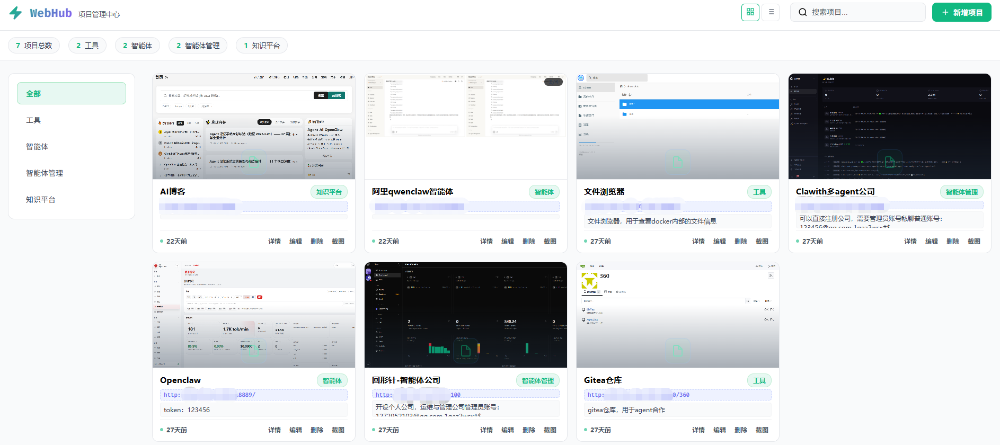
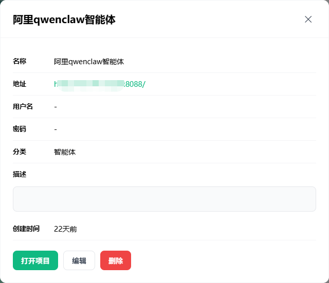
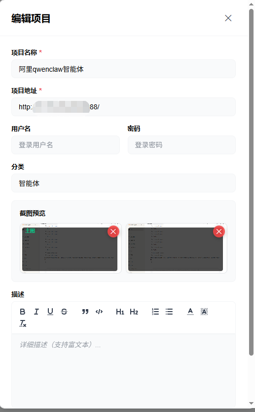
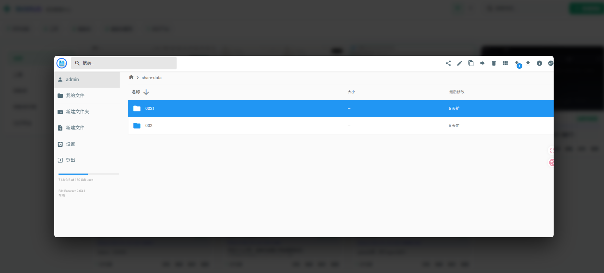

# WebHub - 项目管理中心

> 轻量级 Web 项目统一管理平台，支持多截图预览、粘贴上传、拖拽导入、分类管理、内嵌浏览。

[](docs/LICENSE)
[](https://nodejs.org)
[](https://expressjs.com)
[](https://www.docker.com)

---

## 目录

- [项目简介](#项目简介)
- [功能特性](#功能特性)
- [系统预览](#系统预览)
- [系统要求](#系统要求)
- [快速开始](#快速开始)
  - [方式一：Docker 部署（推荐）](#方式一docker-部署推荐)
  - [方式二：本地运行](#方式二本地运行)
- [配置说明](#配置说明)
- [项目结构](#项目结构)
- [API 接口](#api-接口)
- [截图机制](#截图机制)
- [开发指南](#开发指南)
- [安全注意事项](#安全注意事项)
- [性能优化](#性能优化)
- [常见问题](#常见问题)
- [贡献指南](#贡献指南)
- [更新日志](#更新日志)
- [相关文档](#相关文档)
- [License](#license)

---

## 项目简介

WebHub 是一个简洁高效的 Web 项目管理中心，将分散的内部系统、管理后台、开发工具等集中在一个平台统一管理。

### 核心能力

- **项目统一管理** — 新增、编辑、删除 Web 项目，支持名称/URL/用户名/密码/分类/描述
- **多截图预览** — 每个项目最多 4 张截图，自动截图 + 手动截图 + 粘贴上传
- **分类与搜索** — 自定义分类标签，关键词实时搜索
- **双视图切换** — 网格视图 / 列表视图自由切换
- **内嵌浏览** — iframe 内嵌打开项目，支持截图捕获
- **拖拽导入** — 从浏览器地址栏拖拽 URL 自动创建项目
- **粘贴上传** — 编辑面板中 Ctrl+V 粘贴截图，即时关联项目
- **富文本描述** — Quill 编辑器支持加粗、列表、代码块等格式

---

## 功能特性

| 功能 | 说明 |
|------|------|
| 📋 项目管理 | 新增 / 编辑 / 删除 Web 项目，支持用户名密码存储 |
| 📸 多截图 | 每项目最多 4 张截图，自动/手动/粘贴三种方式 |
| 🖼️ 截图预览 | 卡片展示截图缩略图，hover 延迟 800ms 弹出大图 |
| 📋 粘贴上传 | 编辑面板中 Ctrl+V 粘贴剪贴板图片作为截图 |
| 🔗 拖拽导入 | 从浏览器地址栏拖拽 URL 到页面自动创建项目 |
| 🔍 搜索过滤 | 按项目名称、URL、描述搜索 |
| 📂 分类管理 | 自定义分类，侧边栏 Tab 快速切换 |
| 🖥️ 双视图 | 网格视图 / 列表视图 |
| 🌐 内嵌浏览 | iframe 内嵌打开，支持截图捕获和新窗口打开 |
| ✏️ 富文本 | Quill 编辑器，支持加粗/斜体/列表/代码块/颜色 |
| 📊 数据统计 | 项目总数、分类统计 |
| 💾 SQLite | better-sqlite3 轻量级数据库，零配置 |

---

## 系统预览

### 主界面



主界面采用卡片式布局，清晰展示所有已管理的项目。每个项目卡片显示项目名称、分类标签、首张截图缩略图和简要描述。顶部工具栏提供搜索、视图切换和新建项目功能，左侧分类导航支持快速筛选。

### 项目详情与内嵌浏览



点击项目卡片后，右侧展开详情面板，展示完整的项目信息和所有截图。支持 iframe 内嵌浏览目标网站，可直接在内嵌页面中操作，也可点击"新窗口打开"在独立标签页访问。截图区域以网格形式展示最多 4 张截图，悬停可查看大图预览。

### 编辑项目



编辑面板提供完整的项目信息修改功能，包括名称、URL、用户名、密码、分类和富文本描述。Quill 富文本编辑器支持加粗、斜体、列表、代码块等多种格式。在编辑状态下，可通过 Ctrl+V 直接粘贴剪贴板中的图片作为项目截图，简化截图上传流程。

### 截图预览



鼠标悬停在截图缩略图上 800ms 后，自动弹出大图预览层。预览层采用半透明背景遮罩，突出显示完整截图内容。预览层设置 `pointer-events: none` 确保不遮挡底层交互，用户可随时移动鼠标关闭预览。支持查看项目的所有截图，方便快速浏览和对比。

---

## 系统要求

| 组件 | 版本要求 |
|------|----------|
| Node.js | ≥ 18.0 |
| npm | ≥ 9.0 |
| 磁盘空间 | ≥ 500MB (含 Puppeteer Chromium) |

> **注意**：首次 `npm install` 时 Puppeteer 会自动下载 Chromium (~170MB)，请确保网络通畅。

---

## 快速开始

### 方式一：Docker 部署（推荐）⭐

> **优势**：一键启动、环境隔离、自动重启、易于部署

#### 前置要求

- 已安装 [Docker Desktop](https://www.docker.com/products/docker-desktop)

#### 一键启动

**Windows 用户：**
```bash
docker-start.bat
```

**Linux/Mac 用户：**
```bash
chmod +x docker-start.sh
./docker-start.sh
```

#### 手动管理

```bash
# 构建并启动
docker-compose up -d

# 查看日志
docker-compose logs -f

# 停止服务
docker-compose down
```

访问：**http://localhost:3000**

📖 详细文档：[docs/DOCKER.md](docs/DOCKER.md)

---

### 方式二：本地运行

#### 1. 安装依赖

```bash
cd web-hub
npm install
```

#### 2. 启动服务

```bash
# Windows
./script/start.bat

# Linux
chmod +x ./script/start.sh && ./script/start.sh

# 或直接使用 npm
npm start
```

#### 3. 访问系统

打开浏览器访问：**http://localhost:3000**

#### 4. 关闭服务

```bash
# Windows
./script/stop.bat

# Linux
./script/stop.sh

# 或手动终止
taskkill /F /IM node.exe   # Windows
pkill -f "node server.js"  # Linux
```

---

## 配置说明

所有配置通过环境变量设置，可在项目根目录创建 `.env` 文件：

```env
# 服务端口 (默认: 3000)
PORT=3000
```

| 变量 | 说明 | 默认值 |
|------|------|--------|
| `PORT` | HTTP 服务端口 | `3000` |

---

## 项目结构

```
web-hub/
├── data/                    # 运行时数据
│   ├── webhub.db           # SQLite 数据库
│   ├── screenshots/        # 截图文件存储
│   │   ├── project-1-*.png
│   │   └── project-2-*.png
│   └── logs/               # 截图日志
├── public/                  # 静态资源
│   ├── css/
│   │   └── style.css       # 样式文件（亮色主题）
│   ├── js/
│   │   └── app.js          # 前端逻辑
│   ├── thumbnails/          # 缩略图缓存
│   └── index.html          # 主页面
├── scripts/                 # 启动/停止脚本
│   ├── start.bat / start.sh
│   └── stop.bat / stop.sh
├── server.js               # Express 后端服务
├── cleanup.js              # 截图清理工具
├── package.json
└── README.md
```

---

## API 接口

### 项目管理

| 方法 | 路径 | 说明 |
|------|------|------|
| `GET` | `/api/projects` | 获取项目列表（支持 `?category=` & `?keyword=`） |
| `GET` | `/api/projects/:id` | 获取单个项目详情 |
| `POST` | `/api/projects` | 新增项目 |
| `PUT` | `/api/projects/:id` | 更新项目 |
| `DELETE` | `/api/projects/:id` | 删除项目（同时删除关联截图） |
| `GET` | `/api/projects/:id/open` | 打开项目（无截图时自动触发截图） |

### 截图管理

| 方法 | 路径 | 说明 |
|------|------|------|
| `GET` | `/api/projects/:id/screenshots` | 获取项目所有截图 |
| `POST` | `/api/projects/:id/screenshot` | 手动触发 Puppeteer 截图 |
| `POST` | `/api/projects/:id/screenshot-upload` | 上传粘贴的图片作为截图（multipart/form-data） |
| `DELETE` | `/api/projects/:id/screenshot/:screenshotId` | 删除指定截图 |

### 统计与分类

| 方法 | 路径 | 说明 |
|------|------|------|
| `GET` | `/api/stats` | 获取统计数据（总数、分类统计） |
| `GET` | `/api/categories` | 获取所有分类 |

### 请求示例

#### 新增项目

```bash
curl -X POST http://localhost:3000/api/projects \
  -H "Content-Type: application/json" \
  -d '{
    "name": "内部管理系统",
    "url": "http://10.174.16.229:8088/",
    "username": "admin",
    "password": "123456",
    "description": "企业内部门户系统",
    "category": "内部系统"
  }'
```

#### 粘贴上传截图

```bash
curl -X POST http://localhost:3000/api/projects/1/screenshot-upload \
  -F "screenshot=@clipboard-image.png"
```

#### 手动触发截图

```bash
curl -X POST http://localhost:3000/api/projects/1/screenshot
```

---

## 截图机制

### 三种截图方式

| 方式 | 触发条件 | 说明 |
|------|----------|------|
| **自动截图** | 首次打开项目（无截图时） | Puppeteer 无头浏览器访问 URL 并截图 |
| **手动截图** | 点击"截图"按钮 | 在 iframe 内嵌浏览时手动触发 |
| **粘贴上传** | 编辑面板中 Ctrl+V | 从剪贴板粘贴图片直接上传 |

### 截图策略

- **数量限制**：每个项目最多 4 张截图
- **分辨率**：1280 × 800 标准桌面尺寸
- **加载策略**：`networkidle0` + 2 秒等待，确保页面完全渲染
- **超时保护**：15 秒加载超时自动跳过
- **浏览器池**：复用 Puppeteer 实例，避免重复启动
- **首张为主图**：第一张截图自动设为卡片缩略图

### 截图存储

- **路径**：`data/screenshots/project-{id}-{timestamp}.png`
- **格式**：PNG
- **访问**：`/screenshots/{filename}`

---

## 开发指南

### 本地开发环境

#### 1. 克隆仓库

```bash
git clone https://github.com/your-username/web-hub.git
cd web-hub
```

#### 2. 安装依赖

```bash
npm install
```

> **提示**：首次安装会下载 Chromium (~170MB)，国内用户建议使用镜像源：
> ```bash
> PUPPETEER_DOWNLOAD_BASE_URL=https://npmmirror.com/mirrors npm install
> ```

#### 3. 启动开发服务器

```bash
# 开发模式（自动重启）
npm run dev

# 或生产模式
npm start
```

#### 4. 访问应用

打开浏览器访问：**http://localhost:3000**

### 调试技巧

- **后端调试**：查看终端输出的日志信息
- **前端调试**：打开浏览器开发者工具 (F12)
- **截图调试**：查看 `data/logs/` 目录下的日志文件
- **数据库查看**：使用 [DB Browser for SQLite](https://sqlitebrowser.org/) 打开 `data/webhub.db`

### 代码结构说明

```
核心模块：
├── server.js          # Express 主服务，路由定义和 API 实现
├── public/js/app.js   # 前端业务逻辑，DOM 操作和 API 调用
├── public/css/style.css # 全局样式和主题定义
└── cleanup.js         # 截图清理工具脚本

数据层：
├── data/webhub.db     # SQLite 数据库
│   ├── projects       # 项目表
│   └── project_screenshots # 截图关联表
└── data/screenshots/  # 截图文件存储
```

### 数据库 Schema

```sql
-- 项目表
CREATE TABLE projects (
    id INTEGER PRIMARY KEY AUTOINCREMENT,
    name TEXT NOT NULL,
    url TEXT NOT NULL,
    username TEXT,
    password TEXT,
    description TEXT,
    category TEXT,
    thumbnail TEXT,
    created_at DATETIME DEFAULT CURRENT_TIMESTAMP,
    updated_at DATETIME DEFAULT CURRENT_TIMESTAMP
);

-- 截图关联表
CREATE TABLE project_screenshots (
    id INTEGER PRIMARY KEY AUTOINCREMENT,
    project_id INTEGER NOT NULL,
    filename TEXT NOT NULL,
    sort_order INTEGER DEFAULT 0,
    created_at DATETIME DEFAULT CURRENT_TIMESTAMP,
    FOREIGN KEY (project_id) REFERENCES projects(id) ON DELETE CASCADE
);
```

---

## 安全注意事项

> ⚠️ **重要警告**：本项目设计用于内网或个人使用，请注意以下安全问题：

### 1. 数据存储安全

- **明文存储**：用户名和密码以明文形式存储在 SQLite 数据库中
- **建议措施**：
  - 仅在内网或可信环境部署
  - 定期备份数据库文件
  - 不要将 `data/webhub.db` 提交到版本控制系统

### 2. 生产环境部署建议

- ✅ 使用 HTTPS 反向代理（如 Nginx）
- ✅ 配置防火墙限制访问 IP
- ✅ 启用基础认证或集成企业 SSO
- ✅ 定期更新 Node.js 和依赖包
- ❌ 避免直接暴露在公网

### 3. XSS 防护

- 富文本描述已通过 Quill 编辑器白名单过滤
- 列表视图使用纯文本提取，防止 HTML 注入
- 详情视图保留 HTML 格式，请确保输入来源可信

### 4. iframe 安全

- 部分网站设置 `X-Frame-Options` 阻止嵌入，这是正常的安全行为
- 建议使用"新窗口打开"功能访问此类网站
- 不要在内嵌页面中输入敏感信息

### 5. 数据备份

```bash
# 备份数据库
cp data/webhub.db data/webhub.db.backup.$(date +%Y%m%d)

# 备份截图
tar -czf screenshots-backup.tar.gz data/screenshots/
```

---

## 性能优化

### 1. 截图管理

- **限制数量**：每个项目最多 4 张截图，避免存储空间膨胀
- **定期清理**：使用 `cleanup.js` 脚本清理无效截图
  ```bash
  node cleanup.js
  ```
- **压缩存储**：截图采用 PNG 格式，如需更小体积可手动转换为 WebP

### 2. 数据库优化

- **索引建议**：对于大量项目（>1000），可添加索引：
  ```sql
  CREATE INDEX idx_projects_category ON projects(category);
  CREATE INDEX idx_projects_name ON projects(name);
  ```
- **定期维护**：
  ```bash
  sqlite3 data/webhub.db "VACUUM;"
  sqlite3 data/webhub.db "ANALYZE;"
  ```

### 3. Puppeteer 优化

- **浏览器复用**：已实现实例池，避免重复启动开销
- **超时控制**：15 秒加载超时保护，防止阻塞
- **内存管理**：长时间运行建议定期重启服务

### 4. 前端性能

- **懒加载**：截图大图采用悬停延迟加载（800ms）
- **视图切换**：列表视图适合大量项目场景
- **搜索优化**：实时搜索采用防抖处理

### 5. Docker 部署优化

```
# docker-compose.yml 资源限制示例
services:
  webhub:
    deploy:
      resources:
        limits:
          cpus: '1.0'
          memory: 512M
```

---

## 常见问题

### Q1: Puppeteer 下载 Chromium 失败？

```bash
# 设置国内镜像
PUPPETEER_DOWNLOAD_BASE_URL=https://npmmirror.com/mirrors npm install
```

### Q2: 截图显示空白/黑色？

- 检查目标 URL 是否可访问
- 部分页面需要较长加载时间，已内置 2 秒等待
- 查看控制台日志中的截图错误信息

### Q3: 如何修改端口？

```bash
PORT=8080 npm start
```

### Q4: 内嵌页面无法显示？

部分网站设置 `X-Frame-Options` 或 `CSP frame-ancestors` 阻止 iframe 嵌入，这是浏览器安全限制。建议使用"新窗口"按钮直接打开。

### Q5: 拖拽标签页没有反应？

Chrome 标签栏拖拽不暴露 URL 数据（浏览器安全限制）。替代方式：
- 从浏览器**地址栏**选中 URL 后拖拽（推荐）
- 从**书签栏**拖拽书签
- 手动复制 URL 后在新增面板粘贴

### Q6: 如何清理截图？

```bash
# 删除所有截图文件
rm -f data/screenshots/*.png

# 重置数据库
sqlite3 data/webhub.db "DELETE FROM project_screenshots;"
sqlite3 data/webhub.db "UPDATE projects SET thumbnail = '';"
```

---

## 贡献指南

欢迎贡献代码、报告问题或提出建议！🎉

### 提交 Issue

在提交 Issue 前，请先搜索是否已有类似问题。

#### Bug 报告

请包含以下信息：
- **环境信息**：Node.js 版本、操作系统、浏览器版本
- **复现步骤**：详细的操作步骤
- **预期行为**：期望的结果
- **实际行为**：实际发生的情况
- **错误日志**：控制台或终端的错误信息
- **截图/录屏**：如有可能，提供可视化证据

#### 功能建议

请说明：
- **需求描述**：想要实现什么功能
- **使用场景**：为什么需要这个功能
- **解决方案**：如果有想法，可以提出实现方案

### 提交 Pull Request

1. **Fork 本仓库**
2. **创建特性分支**
   ```bash
   git checkout -b feature/your-feature-name
   ```
3. **提交更改**
   ```bash
   git commit -m "feat: add your feature description"
   ```
   
   **Commit 规范**：
   - `feat:` 新功能
   - `fix:` 修复 bug
   - `docs:` 文档更新
   - `style:` 代码格式调整
   - `refactor:` 代码重构
   - `test:` 测试相关
   - `chore:` 构建过程或辅助工具变动

4. **推送到分支**
   ```bash
   git push origin feature/your-feature-name
   ```
5. **创建 Pull Request**
   - 清晰描述改动内容
   - 关联相关 Issue（如有）
   - 等待 CI 检查通过

### 代码规范

- **JavaScript**：遵循 ES6+ 标准，使用 `const/let` 而非 `var`
- **命名规范**：变量/函数使用 camelCase，类名使用 PascalCase
- **注释**：关键逻辑必须添加注释
- **缩进**：使用 2 空格缩进
- **分号**：语句末尾必须加分号

### 开发流程

```
graph LR
    A[Fork 仓库] --> B[创建分支]
    B --> C[本地开发]
    C --> D[测试验证]
    D --> E[提交 PR]
    E --> F[Code Review]
    F --> G[合并到主分支]
```

### 成为维护者

如果你积极参与项目贡献，我们欢迎你成为项目维护者！请联系项目所有者了解详情。

---

## 更新日志

### v1.0.0 (2026-04-17)

#### ✨ 新功能
- 项目管理：新增/编辑/删除 Web 项目
- 多截图支持：每项目最多 4 张截图
- 三种截图方式：自动截图、手动截图、粘贴上传
- 双视图切换：网格视图 / 列表视图
- 分类管理：自定义分类标签
- 内嵌浏览：iframe 内嵌打开项目
- 拖拽导入：从地址栏拖拽 URL
- 富文本描述：Quill 编辑器支持
- 数据统计：项目总数和分类统计

#### 🐛 Bug 修复
- 修复截图超时导致的卡死问题
- 修复 hover 预览遮挡鼠标事件的问题
- 修复富文本内容在列表视图显示 HTML 标签的问题

#### 🔧 优化改进
- Puppeteer 浏览器实例复用，提升性能
- 截图加载超时保护（15 秒）
- 悬浮层 pointer-events 穿透优化
- 列表视图纯文本提取，防止 XSS

#### 📝 文档
- 完善 README 文档
- 添加 Docker 部署指南
- 添加 API 接口文档

---

### 计划中的功能

- [ ] 用户认证系统
- [ ] 项目分组/文件夹功能
- [ ] 截图自动更新定时任务
- [ ] 深色主题支持
- [ ] 移动端适配
- [ ] 数据导出/导入功能
- [ ] 项目访问统计
- [ ] 浏览器书签导入

---

## 相关文档

- 📖 **[贡献指南](docs/CONTRIBUTING.md)** - 详细的代码贡献流程、规范和最佳实践
- 🗺️ **[项目路线图](docs/ROADMAP.md)** - 短期和长期开发计划，未来功能规划
- ✅ **[开源准备清单](docs/OPEN_SOURCE_CHECKLIST.md)** - GitHub 开源完整检查清单和推广建议
- 🐳 **[Docker 部署指南](docs/DOCKER.md)** - Docker 容器化部署详细说明
- 📋 **[Docker 快速参考](docs/DOCKER_QUICK_REFERENCE.md)** - Docker 常用命令速查
- 📝 **[文档迁移说明](docs/MIGRATION.md)** - 文档结构重组的详细说明

---

## License

ISC

---

*最后更新：2026-05-14*
